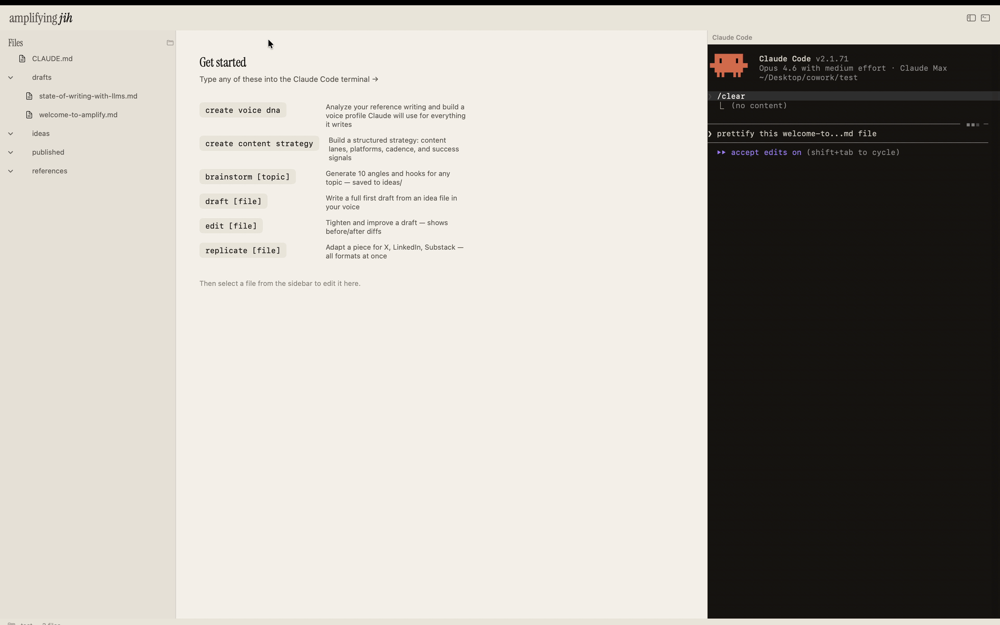

# Amplify

**Write with agents. Sound like yourself.**

A writing IDE for developers who write with AI agents. Amplify gives your agent project-level context — a CLAUDE.md with your voice rules, a voice profile built from your past writing, and clean workspace isolation — so every draft sounds like you, not like AI.

[Download for Mac](https://github.com/jihjihk/amplify/releases/latest) · [Landing page](https://jihjihk.github.io/amplify)



---

## Why Amplify

Note-taking apps send individual files to AI with zero context about your voice, your audience, or your workflow. Amplify gives your agent a full project every time.

- **CLAUDE.md at the root** — Like `.eslintrc` for your writing. Voice rules, anti-patterns, and commands that your agent reads on every interaction.
- **Voice DNA** — One command analyzes your past writing and builds a voice profile. Every draft, edit, and brainstorm runs through it automatically.
- **Isolated workspaces** — Each writing project is its own folder with its own context. Your newsletter and your technical blog don't bleed into each other.
- **Built-in terminal** — Claude Code runs inside the app. Chain commands, iterate on drafts, see exactly what the agent does.
- **Plain Markdown, plain folders** — No proprietary format, no database, no sync layer. Git-native. Open your files in anything.
- **Bring your own subscription** — Uses Claude Code. No API key, no extra billing, no account.

## Getting started

1. [Download Amplify.dmg](https://github.com/jihjihk/amplify/releases/latest), open it, drag to Applications
2. Right-click Amplify → Open (first launch only, app is ad-hoc signed)
3. Choose a folder as your workspace
4. In the terminal, run `create voice dna`
5. Start writing

**Requires:** macOS 14 Sonoma or later · [Claude Code](https://claude.ai/code) installed

## Commands

| Command | What it does |
|---------|-------------|
| `create voice dna` | Analyzes your reference writing, builds a voice profile |
| `create content strategy` | Generates a strategy doc: positioning, lanes, cadence |
| `brainstorm [topic]` | 10 angles and hooks, saved to `ideas/` |
| `draft [file]` | Full first draft in your voice |
| `edit [file]` | Tighten a draft, shows before/after |
| `critique [file]` | Honest feedback on argument and structure |
| `replicate [file]` | Adapts a piece for X, LinkedIn, and Substack |

## Build from source

Requires macOS 14+ and Swift 6+.

```bash
git clone https://github.com/jihjihk/amplify.git
cd amplify/WritingHub
swift build
swift run
```

## Architecture

```
WritingHub/
  Sources/
    WritingHub/          # App entry point, AppDelegate
    WritingHubLib/       # Core library
      Models/            # WritingPiece, FrontMatter, SkillPack, HubConfig, WorkspaceItem
      Views/             # Sidebar, EditorView, TabBar, TerminalPanelView, StatusBar
      ViewModels/        # HubViewModel
      Services/          # FolderManager, FileWatcher, GitService
      Resources/         # CLAUDETemplate, Fonts
  Tests/
    WritingHubTests/
landing/                 # Landing page (GitHub Pages)
```

## License

Apache 2.0 — see [LICENSE](LICENSE).
